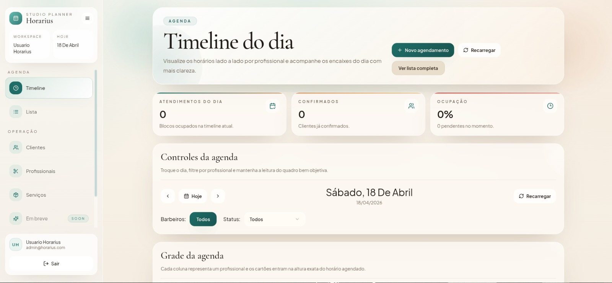

# Luiz Otávio | Portfólio Full Stack

[](https://react.dev/)
[](https://vite.dev/)
[](https://reactrouter.com/)
[](https://github.com/Luizbc2/PortfolioLuiz)

Portfólio pessoal desenvolvido para apresentar projetos acadêmicos reais, stack utilizada em cada entrega e links publicados. O foco do site é mostrar meu perfil como desenvolvedor full stack de forma direta, com visual próprio e navegação simples.

## Preview



## O que tem no site

- Hero em estilo terminal com animações e identidade mais voltada para desenvolvimento.
- Seção de projetos com preview real, stack, descrição e links.
- Seção de stack com tecnologias que uso no frontend, backend e banco de dados.
- Seção sobre mim com resumo da minha formação e experiência atual.
- Favicon e identidade visual personalizados.

## Projetos destacados

### Horarius
Sistema de agenda com login, painel e gerenciamento de clientes, serviços e profissionais.

**Stack:** React, Node.js, PostgreSQL

- Site: https://horarius.vercel.app/login
- Repositório: https://github.com/Luizbc2/Horarius

### Nis Mello Ateliê
Site institucional com apresentação da marca, catálogo e contato.

**Stack:** PHP, HTML, CSS, JavaScript

- Site: https://nismelloatelie.vercel.app/
- Repositório: https://github.com/Luizbc2/NisMelloAtelie

### LouisDeals
Catálogo web com busca por código, filtros e links diretos para oferta.

**Stack:** Next.js, React, TypeScript

- Site: https://louisdeals-nine.vercel.app/
- Repositório: https://github.com/Luizbc2/louisdeals

### Cashflow
Sistema financeiro colaborativo com autenticação e separação entre frontend e backend.

**Stack:** TypeScript, PHP, Laravel, Blade, CSS

- Site: https://cashflow-gbrg.vercel.app/
- Repositório: https://github.com/cardealpauloand/cash_flow

## Tecnologias do projeto

- React
- Vite
- React Router DOM
- CSS
- Fontsource

## Como rodar localmente

```bash
npm install
npm run dev
```

Para gerar a build de produção:

```bash
npm run build
```

## Estrutura principal

```bash
src/
  assets/
  components/
  data/
  pages/
```

## Autor

**Luiz Otávio**

- GitHub: https://github.com/Luizbc2
- LinkedIn: https://www.linkedin.com/in/luiz-otavio-mello-de-campos-66699224b/
